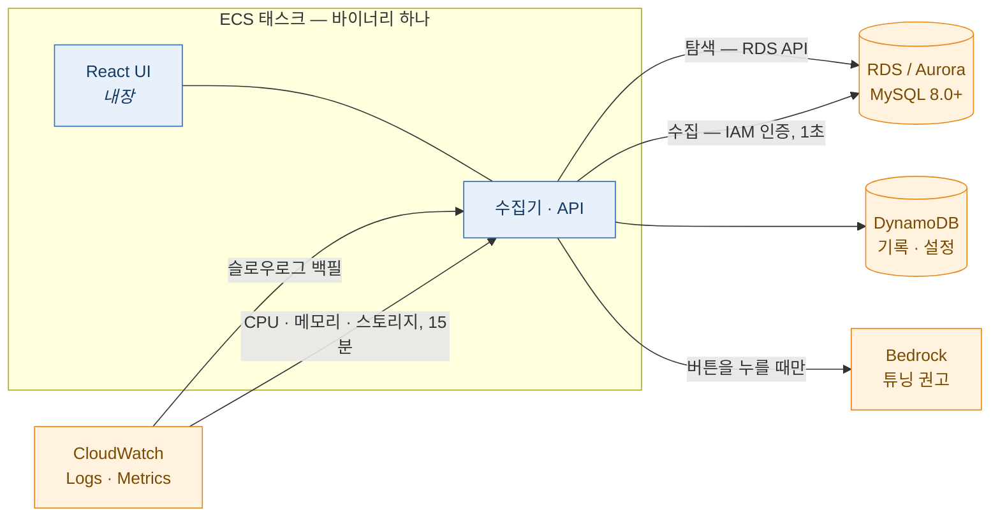

# dbmon — AWS RDS / Aurora MySQL 슬로우 쿼리 모니터

슬로우 쿼리 실시간 수집, 실행계획, CloudWatch 메트릭, AI 튜닝 권고를 Rust 바이너리
하나(React UI 내장)로 제공한다.

> **English**: [README.md](README.md) · 설치: [`docs/install.ko.md`](docs/install.ko.md)



## 무엇을 하는가

| 기능 | 방식 |
|---|---|
| **슬로우 쿼리 수집** | 1초 주기 `performance_schema` 조회로 **진행 중인** 쿼리를 잡고, CloudWatch Logs 슬로우로그로 정확한 수치를 채운다. 둘을 **한 레코드로 병합**하므로 "도는 중에 잡았다" 와 "정확한 검사 행수" 를 동시에 얻는다. |
| **실행계획** | `EXPLAIN FORMAT=JSON` 재실행 (`SELECT` 권한만으로 된다). 리터럴은 수집 시점에 마스킹된다. 표와 그래프 두 형태로 본다. |
| **플릿 메트릭** | CloudWatch(CPU·메모리·스토리지, 15분)와 자체 수집(연결·QPS·스레드·락, 5초)을 한 줄에 놓는다. 비용을 설계에 넣었다 — 엔진당 3개 지표, 정렬된 창 캐시. |
| **AI 튜닝 권고** | 실행계획에서 버튼 하나 → 대상 DB 의 테이블 명세·인덱스 카디널리티를 읽어 Bedrock 에 보내고 → 근거가 붙은 인덱스·재작성 제안을 받는다. 마크다운 다운로드에도 함께 들어간다. |
| **탐색** | 태그 기반 환경 분류(`dev`/`stg`/`prd`), 멀티 리전, `sts:AssumeRole` 로 멀티 계정. 인스턴스는 **멈춘 상태**로 등록되고, 사람이 **시작**을 누른다. |
| **알림 채널 설정** | Slack 웹훅/봇 설정 + 문구 템플릿 (발송 엔진은 아직 배선되지 않았다 — [상태](#상태) 참고). |

코드의 형태를 정한 원칙, 한 줄씩:

- **실패는 크게 알린다.** CloudWatch 조회가 실패하면 "못 읽었다" 로 표시한다 — 빈 값으로
  보여주면 "데이터가 없다" 로 읽힌다.
- **비밀을 저장하지 않는다.** DB 는 IAM 인증만 쓰고, 채널 자격증명은 Secrets Manager 에
  두고 설정에는 그 **참조**만 담는다.
- **리터럴은 나가지 않는다.** 실행계획·알림·Bedrock 에 닿기 전에 마스킹한다.
- **파괴적인 것은 자동화하지 않는다.** DDL 실행 없음, `ANALYZE TABLE` 없음, 수집 자동
  시작 없음.

## 화면

실제 RDS·Aurora 를 상대로 찍었다. 머리말의 계정 번호만 0 으로 바꿨고, 지표값·계획
비용·튜닝 권고는 도구가 실제로 낸 것이다. 데이터는 합성 시드다 — 누군가의 운영
트래픽이 아니다.

### RDS — 탐색과 수집 제어


탐색은 인스턴스를 자동으로 등록하고 **멈춘 상태**로 둔다. 수집은 사람이 버튼을 눌러야
시작하고, 정지 스코프는 전체·환경별·인스턴스별로 나뉜다.

### Metrics — 두 출처를 한 줄에


CloudWatch(CPU·여유 메모리·스토리지, 15분) 옆에 자체 수집(연결·스레드·락·QPS·Slow/s,
5초)이 붙는다. `10 / 90` 은 현재 연결 / `max_connections` 다 — 모수 없는 "10" 은 아무
것도 말해 주지 않는다.

### Instance — 한 대를 자세히


### Slow Query — 무엇이 잡혔는가


**진행 중**은 지금까지의 실행시간이고, **추적 끊김**은 하한이다 — 시작은 알지만 끝을
모른다. 아직 돌고 있을 수 있는 쿼리에 "4.0초" 를 박으면 그건 거짓이다.

### Plan — 저장된 실행계획


계획은 수집 시점에 마스킹되므로 리터럴 정책과 무관하게 이 화면에 리터럴이 없다.
같은 계획을 그래프로 — 4,550만 행 해시 조인이 이 쿼리의 전부다:


### AI 튜닝 권고


버튼을 누를 때 생성된다. 계획에 더해 대상 DB 에서 읽은 테이블 명세와 인덱스
카디널리티를 함께 보낸다. 주장마다 근거가 된 계획 노드나 스키마 값을 인용하고, DDL 은
보여주되 실행하지 않고, 모델이 알 수 없었던 것은 추측하지 않고 적어 둔다.

### Slow Log — CloudWatch 원천


### Statistics — 다이제스트 추이


### Options — 운영 설정


알림, 탐색 범위, 로그인, Bedrock 모델. DynamoDB 에 저장되고 30초 안에 모든 워커에
반영된다.

## 상태

| 영역 | 상태 |
|---|---|
| 탐색·수집·실행계획·메트릭·설정·AI 튜닝 | **동작** (실제 RDS/Aurora 로 검증) |
| Cognito 로그인 | 설정만 — JWKS 검증기가 배선되지 않았다 (`COGNITO_READY = false`) |
| 알림 발송 | 채널·문구는 저장된다. 규칙 평가·발송은 별 마일스톤 |
| 콜드 티어 (Athena/Iceberg) | 철회 — DynamoDB 보존이 35일이고 그 밖은 마크다운 내보내기가 덮는다 |

실제 AWS 계정을 상대로 개발한 개인 프로젝트다. `docs/` 의 설계 문서가 정본이고,
**되돌린 결정도 이유와 함께** 남겨 두었다.

---

# ECS 배포

전체 경로: **이미지 → DynamoDB 테이블 → IAM → 네트워크 → ECS 서비스 → DB 계정 →
화면 설정.**

아래는 `ap-northeast-2`, 계정 `123456789012` 기준이다. Terraform 은
[`infra/layers/`](infra/) 에 있고, 수동 절차를 다 적어 둔 이유는 그 Terraform 이
무엇을 하는지 검토할 수 있어야 하기 때문이다.

## 설치

설치 안내 전체는 **[docs/install.ko.md](docs/install.ko.md)** 에 있다 — 손으로 만드는 경로와
Terraform 경로, 함정을 짚은 IAM 정책, 보안 그룹, 태스크 정의, 확인 절차, 그리고 무엇이 왜
깨지는지 표.

방향만 잡는 최단 경로:

```bash
# 1. DynamoDB 2개 + KMS 키                       → docs/install.ko.md §2
# 2. IAM 역할 2개 (task / execution)             → docs/install.ko.md §3
# 3. 보안 그룹 (앱 + 대상 DB 인바운드)            → docs/install.ko.md §4
# 4. arm64 이미지 푸시 → 태스크 정의 → 서비스     → docs/install.ko.md §1, §5
curl -s "$URL/readyz" | jq                    # → docs/install.ko.md §8
```

English: **[docs/install.md](docs/install.md)**.

## 로컬 개발

핵심 루프는 AWS 계정 없이 돈다.

```bash
docker compose up -d          # MySQL 8.0 / 8.4 + DynamoDB Local
just local-init               # 로컬 테이블 생성
cargo run -p dbmon -- --config local/dbmon.toml --log-pretty serve
npm --prefix web run dev      # 또는 :8080 의 내장 UI
```

실제 AWS 상대로(SSO + VPN, 시드 DB 는 프라이빗):

```bash
aws sso login --profile <profile>
cargo run -p dbmon -- --config local/dbmon-aws.toml --log-pretty serve
```

테스트: `cargo test`(단위 + 통합 617개, 통합은 MySQL 컨테이너를 띄운다),
`npm --prefix web test`. `cargo clippy --all-targets -- -D warnings` 는 깨끗하고 CI 가
강제한다.

## 저장소 구조

```
crates/core        도메인: AWS·MySQL·HTTP 를 모른다. 포트(trait)가 여기 있다.
crates/normalize   SQL 정규화 + 리터럴 마스킹 + 다이제스트
crates/planparse   EXPLAIN JSON → 노드·경고, 리터럴 마스킹 (T-16)
crates/dbmon       어댑터(AWS·MySQL·HTTP) + 수집 루프 + 바이너리
web                React 19 + Tailwind 4 UI, 바이너리에 내장된다
infra/layers       Terraform: 00-bootstrap → 10-storage → 40-compute → 60-seed
docs               설치 안내(영/한) + 스크린샷. 설계 문서는 공개하지 않는다.
```

## 라이선스

아직 없다. `LICENSE` 가 들어오기 전까지는 모든 권리를 보유한다 — 읽고 평가하는 용도이고
재배포는 아니다.
