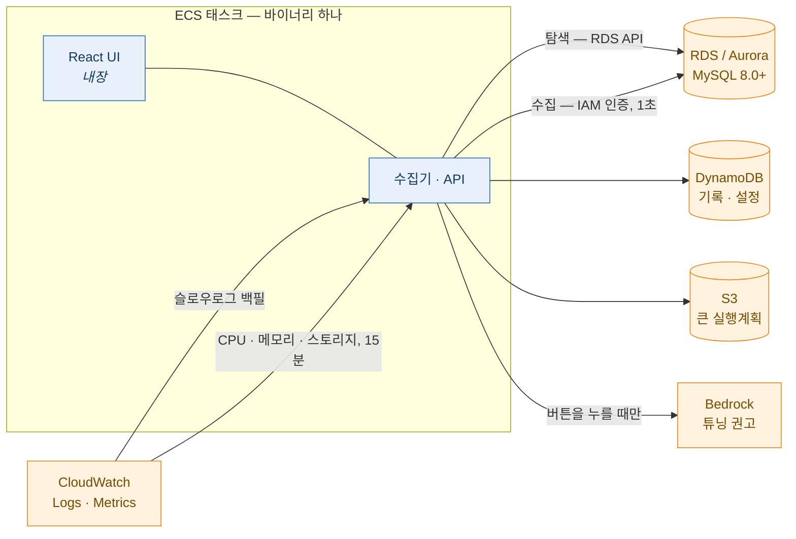

# dbmon — AWS RDS / Aurora MySQL 슬로우 쿼리 모니터

슬로우 쿼리 실시간 수집, 실행계획, CloudWatch 메트릭, AI 튜닝 권고를 Rust 바이너리
하나(React UI 내장)로 제공한다.

> **English**: [README.md](README.md) · 설계 문서: [`docs/`](docs/) 26편



## 무엇을 하는가

| 기능 | 방식 |
|---|---|
| **슬로우 쿼리 수집** | 1초 주기 `performance_schema` 조회로 **진행 중인** 쿼리를 잡고, CloudWatch Logs 슬로우로그로 정확한 수치를 채운다. 둘을 **한 레코드로 병합**하므로 "도는 중에 잡았다" 와 "정확한 검사 행수" 를 동시에 얻는다. |
| **실행계획** | `EXPLAIN FORMAT=JSON` 재실행 (`SELECT` 권한만으로 된다). 리터럴은 수집 시점에 마스킹된다. 표와 그래프 두 형태로 본다. |
| **플릿 메트릭** | CloudWatch(CPU·메모리·스토리지, 15분)와 자체 수집(연결·QPS·스레드·락, 5초)을 한 줄에 놓는다. 비용을 설계에 넣었다 — 엔진당 3개 지표, 정렬된 창 캐시. |
| **AI 튜닝 권고** | 실행계획에서 버튼 하나 → 대상 DB 의 테이블 명세·인덱스 카디널리티를 읽어 Bedrock 에 보내고 → 근거가 붙은 인덱스·재작성 제안을 받는다. 마크다운 다운로드에도 함께 들어간다. |
| **탐색** | 태그 기반 환경 분류(`dev`/`stg`/`prd`), 멀티 리전, `sts:AssumeRole` 로 멀티 계정. 인스턴스는 **멈춘 상태**로 등록되고, 사람이 **시작**을 누른다. |
| **알림 채널 설정** | Slack 웹훅/봇 설정 + 문구 템플릿 (발송 엔진은 아직 배선되지 않았다 — [상태](#상태) 참고). |

코드의 형태를 정한 원칙, 한 줄씩:

- **실패는 크게 알린다.** CloudWatch 조회가 실패하면 "못 읽었다" 로 표시한다 — 빈 값으로
  보여주면 "데이터가 없다" 로 읽힌다.
- **비밀을 저장하지 않는다.** DB 는 IAM 인증만 쓰고, 채널 자격증명은 Secrets Manager 에
  두고 설정에는 그 **참조**만 담는다.
- **리터럴은 나가지 않는다.** 실행계획·알림·Bedrock 에 닿기 전에 마스킹한다.
- **파괴적인 것은 자동화하지 않는다.** DDL 실행 없음, `ANALYZE TABLE` 없음, 수집 자동
  시작 없음.

## 화면

실제 RDS·Aurora 를 상대로 찍었다. 머리말의 계정 번호만 0 으로 바꿨고, 지표값·계획
비용·튜닝 권고는 도구가 실제로 낸 것이다. 데이터는 합성 시드다 — 누군가의 운영
트래픽이 아니다.

### RDS — 탐색과 수집 제어


탐색은 인스턴스를 자동으로 등록하고 **멈춘 상태**로 둔다. 수집은 사람이 버튼을 눌러야
시작하고, 정지 스코프는 전체·환경별·인스턴스별로 나뉜다.

### Metrics — 두 출처를 한 줄에


CloudWatch(CPU·여유 메모리·스토리지, 15분) 옆에 자체 수집(연결·스레드·락·QPS·Slow/s,
5초)이 붙는다. `10 / 90` 은 현재 연결 / `max_connections` 다 — 모수 없는 "10" 은 아무
것도 말해 주지 않는다.

### Instance — 한 대를 자세히


### Slow Query — 무엇이 잡혔는가


**진행 중**은 지금까지의 실행시간이고, **추적 끊김**은 하한이다 — 시작은 알지만 끝을
모른다. 아직 돌고 있을 수 있는 쿼리에 "4.0초" 를 박으면 그건 거짓이다.

### Plan — 저장된 실행계획


계획은 수집 시점에 마스킹되므로 리터럴 정책과 무관하게 이 화면에 리터럴이 없다.
같은 계획을 그래프로 — 4,550만 행 해시 조인이 이 쿼리의 전부다:


### AI 튜닝 권고


버튼을 누를 때 생성된다. 계획에 더해 대상 DB 에서 읽은 테이블 명세와 인덱스
카디널리티를 함께 보낸다. 주장마다 근거가 된 계획 노드나 스키마 값을 인용하고, DDL 은
보여주되 실행하지 않고, 모델이 알 수 없었던 것은 추측하지 않고 적어 둔다.

### Slow Log — CloudWatch 원천


### Statistics — 다이제스트 추이


### Options — 운영 설정


알림, 탐색 범위, 로그인, Bedrock 모델. DynamoDB 에 저장되고 30초 안에 모든 워커에
반영된다.

## 상태

| 영역 | 상태 |
|---|---|
| 탐색·수집·실행계획·메트릭·설정·AI 튜닝 | **동작** (실제 RDS/Aurora 로 검증) |
| Cognito 로그인 | 설정만 — JWKS 검증기가 배선되지 않았다 (`COGNITO_READY = false`) |
| 알림 발송 | 채널·문구는 저장된다. 규칙 평가·발송은 별 마일스톤 |
| 콜드 티어 (Athena/Iceberg) | 철회 — DynamoDB 보존이 35일이고 그 밖은 마크다운 내보내기가 덮는다 |

실제 AWS 계정을 상대로 개발한 개인 프로젝트다. `docs/` 의 설계 문서가 정본이고,
**되돌린 결정도 이유와 함께** 남겨 두었다.

---

# ECS 배포

전체 경로: **이미지 → DynamoDB 테이블 → IAM → 네트워크 → ECS 서비스 → DB 계정 →
화면 설정.**

아래는 `ap-northeast-2`, 계정 `123456789012` 기준이다. Terraform 은
[`infra/layers/`](infra/) 에 있고, 수동 절차를 다 적어 둔 이유는 그 Terraform 이
무엇을 하는지 검토할 수 있어야 하기 때문이다.

## 1. 이미지

`.github/workflows/release.yml` 이 `main` 푸시마다 발행한다.

```
ghcr.io/<owner>/<repo>:latest          # 멀티 아키텍처 (arm64 + amd64)
ghcr.io/<owner>/<repo>:sha-<commit>    # 불변 — 태스크 정의에는 이걸 쓴다
```

워크플로는 여기서 끝난다. AWS 자격증명을 들지 않는다 — 이미지를 발행하는 일과 배포하는
일은 폭발 반경이 다르고, 계정에 쓸 수 있는 빌드 러너는 레지스트리에만 쓸 수 있는 러너보다
훨씬 큰 표적이다.

### 이미지를 ECS 로 가져가는 방법

GHCR 패키지가 **공개**면 ECS 가 설정 없이 끌어간다.

**비공개**면(private 저장소의 기본값) 태스크의 **실행 롤**에 레지스트리 자격증명이 필요하다.
`read:packages` 를 가진 GitHub 개인 액세스 토큰을 넣는다:

```bash
aws secretsmanager create-secret --name dbmon/ghcr \
  --secret-string '{"username":"<github-user>","password":"<read:packages PAT>"}'
```

컨테이너 정의에서 참조하고, 그 ARN 에 대한 `secretsmanager:GetSecretValue` 를 **실행 롤**에
준다(태스크 롤이 아니다 — 앱이 이미지를 끌 수 있어서는 안 된다):

```jsonc
"repositoryCredentials": {
  "credentialsParameter": "arn:aws:secretsmanager:ap-northeast-2:123456789012:secret:dbmon/ghcr-AbCdEf"
}
```

또는 릴리스마다 ECR 로 한 번 복사한다. 재빌드가 아니라 `imagetools create` 를 쓴다 —
같은 다이제스트를 옮기므로 검증한 바이트와 도는 바이트가 같다:

```bash
docker buildx imagetools create \
  -t 123456789012.dkr.ecr.ap-northeast-2.amazonaws.com/dbmon:sha-<commit> \
  ghcr.io/<owner>/<repo>:sha-<commit>
```

ECS 에는 보통 ECR 이 맞다 — 같은 계정 IAM, 이그레스 요금 없음, VPC 엔드포인트 —
그리고 풀 자격증명 문제가 아예 없어진다.

이미지는 **arm64 우선**이다(Graviton: 같은 성능에 약 20% 싸다). UID 10001 로 돌고,
컴파일러나 셸 유틸리티가 들어 있지 않고, 바이너리 자신의 `healthcheck` 서브커맨드를
부르는 `HEALTHCHECK` 가 붙어 있다 — 런타임 레이어에 `curl` 을 넣지 않기 위해서다.

로컬 빌드:

```bash
docker build -t dbmon:dev .
docker run --rm dbmon:dev --version
```

## 2. 저장소 (DynamoDB + S3)

테이블 두 개. **태스크가 뜨기 전에 있어야 한다** — 앱이 만들지 않는다(만들려면
`dynamodb:CreateTable` 이 필요하고, 모니터링 태스크가 그 권한을 들고 있어서는 안 된다).

| 테이블 | 키 | 비고 |
|---|---|---|
| `dbmon-data` | PK `S`, SK `S` | 슬로우 쿼리, 다이제스트, 롤업, 인스턴스, 체크포인트, 튜닝 권고. TTL 속성 `ttl`(35일). |
| `dbmon-config` | PK `S`, SK `S` | 설정(`CFG/GLOBAL`), 정지 스코프, 리스. TTL 없음. |

`dbmon-data` 에는 GSI 두 개가 필요하다.

| 인덱스 | PK | SK | 용도 |
|---|---|---|---|
| `GSI1` | `GSI1PK` | `GSI1SK` | 다이제스트→최근 샘플, 진행 중 레코드 희소 스윕 |
| `GSI2` | `GSI2PK` | `GSI2SK` | 소요시간 버킷 조회 |

둘 다 PITR 을 권한다. `terraform -chdir=infra/layers/10-storage apply` 가 올바른 키
스키마로 만든다(프로바이더 6.x 가 GSI 안의 `hash_key` 를 개명했다 — 락 파일을 커밋해 둔
이유다).

300KB 를 넘는 실행계획은 S3 로 뺀다. 버킷은 선택이고, 없으면 그 계획은 사유가 기록된 채
버려진다.

## 3. IAM — 태스크 롤

앱이 쓰는 유일한 신원이다. 문장 9개를 각각 좁혀 놓았고, 정본은
`infra/layers/40-compute/iam.tf` 다.

### 3.1 저장소

```json
{ "Sid": "DynamoDbData", "Effect": "Allow",
  "Action": ["dynamodb:GetItem","dynamodb:PutItem","dynamodb:UpdateItem","dynamodb:DeleteItem",
             "dynamodb:Query","dynamodb:BatchWriteItem","dynamodb:BatchGetItem"],
  "Resource": ["arn:aws:dynamodb:ap-northeast-2:123456789012:table/dbmon-data",
               "arn:aws:dynamodb:ap-northeast-2:123456789012:table/dbmon-data/index/*",
               "arn:aws:dynamodb:ap-northeast-2:123456789012:table/dbmon-config"] }
```

```json
{ "Sid": "DenyScan", "Effect": "Deny", "Action": ["dynamodb:Scan"], "Resource": "*" }
```

`Scan` 명시 거부는 의도적이다. 500대짜리 테이블을 한 번 잘못 스캔하면 비용 사건이면서
지연 사건이다. 코드는 스캔하지 않는데, 이 문장이 그걸 **구조로** 만든다.

### 3.2 탐색 (RDS)

```json
{ "Sid": "DiscoveryReadOnly", "Effect": "Allow",
  "Action": ["rds:DescribeDBInstances","rds:DescribeDBClusters","rds:DescribeDBEngineVersions",
             "rds:DescribeDBParameters","rds:DescribeDBParameterGroups",
             "rds:DescribePendingMaintenanceActions","rds:ListTagsForResource"],
  "Resource": "*" }
```

`Resource: "*"` 는 불가피하다 — `rds:Describe*` 는 리소스 수준 권한을 지원하지 않는다.
범위는 대신 설정에서 강제한다(`discovery.allowed_vpc_ids`, `denied_name_substrings`,
`reject_production_tags`).

### 3.3 DB 접속 (IAM 인증 — 비밀번호 없음)

```json
{ "Effect": "Allow", "Action": ["rds-db:connect"],
  "Resource": "arn:aws:rds-db:ap-northeast-2:123456789012:dbuser:*/dbmon" }
```

`dbuser:*/dbmon` 은 "아무 인스턴스의 `dbmon` 계정" 이다. 비프로덕션 계정에서는
`db-XXXX` 리소스 ID 를 열거하는 편이 낫다(`var.db_auth_resource_ids`) — 개발 배포가
프로덕션 인스턴스에 닿지 못하게 된다.

> 여기 들어가는 것은 인스턴스 이름이 아니라 **`DbiResourceId`**(`db-ABC123…`) 다.
> `aws rds describe-db-instances --query 'DBInstances[].[DBInstanceIdentifier,DbiResourceId]'`

### 3.4 메트릭·슬로우로그

```json
{ "Sid": "Metrics", "Effect": "Allow",
  "Action": ["cloudwatch:GetMetricData","cloudwatch:ListMetrics"], "Resource": "*",
  "Condition": { "StringEquals": { "cloudwatch:namespace": "AWS/RDS" } } }
```

```json
{ "Sid": "SlowLogRead", "Effect": "Allow", "Action": ["logs:FilterLogEvents"],
  "Resource": ["arn:aws:logs:ap-northeast-2:123456789012:log-group:/aws/rds/instance/*/slowquery:*",
               "arn:aws:logs:ap-northeast-2:123456789012:log-group:/aws/rds/instance/*/slowquery"] }
```

슬로우로그에는 **쿼리 리터럴이 들어 있다.** `/aws/rds/instance/*/slowquery` 는
`/aws/rds/*` 보다 훨씬 좁다 — 후자는 감사 로그(모든 문장이 남는다)까지 포함한다.

로그 그룹이 아직 없으면(슬로우로그가 한 번도 쓰이지 않았거나 내보내기가 꺼졌거나)
`슬로우로그 원천이 없다 … (장애가 아니다)` 를 라운드당 한 번 info 로 남기고 계속 간다 —
그룹이 없는 것은 환경의 사실이지 장애가 아니다.

### 3.5 멀티 리전

**추가 IAM 은 없다.** 같은 태스크 롤이 모든 리전에서 동작하고, 앱이 리전별 클라이언트를
만든다. 리전은 **설정 → 탐색 범위**(또는 파일 설정 `aws.target_regions`)에서 정한다.
"전체 리전" 옵션은 의도적으로 없다 — 리전마다 탐색 라운드당 `DescribeDBInstances` 가
한 번 나가고, 대부분의 계정은 RDS 가 한두 리전에만 있다.

리전별로 읽는 것은 그 리전에 있어야 한다. 슬로우로그 그룹은 리전 자원이고, CloudWatch
지표는 인스턴스가 있는 리전에 있다(그래서 앱이 CloudWatch 클라이언트를 `(계정, 리전)`
으로 키잉한다).

### 3.6 멀티 계정

mgmt 계정 태스크 롤:

```json
{ "Sid": "AssumeDiscoveryRole", "Effect": "Allow", "Action": ["sts:AssumeRole"],
  "Resource": ["arn:aws:iam::111122223333:role/dbmon-discovery"] }
```

대상 계정의 `dbmon-discovery` 역할 — 신뢰 정책:

```json
{ "Version": "2012-10-17",
  "Statement": [{ "Effect": "Allow",
    "Principal": { "AWS": "arn:aws:iam::123456789012:role/dbmon-task" },
    "Action": "sts:AssumeRole",
    "Condition": { "StringEquals": { "sts:ExternalId": "dbmon" } } }] }
```

권한:

```json
{ "Version": "2012-10-17",
  "Statement": [{ "Effect": "Allow",
    "Action": ["rds:DescribeDBInstances","rds:DescribeDBClusters","rds:ListTagsForResource",
               "cloudwatch:GetMetricData"],
    "Resource": "*" }] }
```

**목록 조회는 API 다 — 네트워크 경로가 필요 없다.** VPC 피어링·TGW 는 그 **다음**
단계, 즉 DB 에 붙을 때 필요하다. 그래서 "목록에는 뜨는데 `unreachable`" 은 정상적으로
존재하는 상태이고, 화면이 그걸 구분해 보여준다.

크로스 계정 **수집**까지 하려면 대상 계정에 `rds-db:connect` 도 붙이고(같은
`dbmon-discovery` 역할에 넣는다) 네트워크 경로와 보안그룹 규칙이 있어야 한다.

계정 목록은 **설정 → 탐색 범위**에 넣는데, `var.discovery_account_ids` 와 같아야 한다.
다르면 탐색이 `AccessDenied` 로 실패하고 그 인스턴스는 목록에 뜨지 않는다.

### 3.7 Bedrock (AI 튜닝)

```json
{ "Sid": "InvokeTuningModel", "Effect": "Allow", "Action": ["bedrock:InvokeModel"],
  "Resource": [
    "arn:aws:bedrock:ap-northeast-2:123456789012:inference-profile/global.anthropic.claude-sonnet-5",
    "arn:aws:bedrock:*::foundation-model/anthropic.claude-sonnet-5"
  ] }
```

크로스 리전 추론 프로파일에는 ARN 두 개가 필요하다 — **프로파일과 그것이 라우팅하는
기반 모델.** 프로파일만 허용하면 호출 시점에 `AccessDenied` 다.

`*` 로 열지 않고 열거하는 이유: 계정의 모델 목록에는 단가가 자릿수로 다른 이미지·비디오
모델도 들어 있다.

계정에서 쓸 수 있는 것 확인:

```bash
aws bedrock list-inference-profiles \
  --query 'inferenceProfileSummaries[?contains(inferenceProfileId,`claude`)].inferenceProfileId'
```

Bedrock 콘솔의 모델 액세스에서 해당 리전에 대해 켜져 있어야 한다.

실측으로 알아 둘 것:

- **`temperature` 를 Claude 5 계열이 거부한다**(`ValidationException: temperature is
  deprecated for this model`). 그래서 `maxTokens` 만 보낸다.
- **`SLEEP()` 이 든 쿼리는 모델이 차단할 수 있다**(`stop_reason=content_filtered`, 빈
  응답) — 시간지연 SQL 인젝션 시그니처로 읽힌다. opus-5 는 막고 sonnet-5 는 통과한다.
  화면이 그 사유를 그대로 보여주므로 모델을 바꾸면 된다.
- **Opus 계열은 출력이 길다.** 잘리면 **출력 토큰 상한**을 8000 으로 올린다.

### 3.8 알림 채널 비밀

```json
{ "Sid": "ReadChannelSecret", "Effect": "Allow", "Action": ["secretsmanager:GetSecretValue"],
  "Resource": ["arn:aws:secretsmanager:ap-northeast-2:123456789012:secret:dbmon/channel/*"] }
```

접두어로 좁힌다. `*` 면 모니터링 태스크가 계정의 모든 비밀을 읽을 수 있게 되고, 거기엔
RDS 마스터 비밀번호가 들어 있다.

### 3.9 실행 롤 (태스크 롤과 별도)

ECS **실행** 롤은 이미지를 끌고 컨테이너 로그를 쓴다:
`AmazonECSTaskExecutionRolePolicy`, ECR·로그 그룹이 CMK 를 쓰면 `kms:Decrypt` 추가.
태스크 롤과 **분리**한다 — 앱이 이미지를 끌거나 밀 수 있어서는 안 된다.

## 4. 네트워크

| 방향 | 규칙 |
|---|---|
| 태스크 → RDS | DB 보안그룹에 **태스크 보안그룹 출처로 TCP 3306** 허용(CIDR 아님). 보안그룹 참조는 IP 가 바뀌어도 살아 있다. |
| 태스크 → AWS API | NAT 게이트웨이, 또는 인터페이스 VPC 엔드포인트: `dynamodb`(게이트웨이), `rds`, `monitoring`, `logs`, `secretsmanager`, `bedrock-runtime`, `sts`, `ecr.api`, `ecr.dkr`, `s3`. 엔드포인트는 NAT 데이터 요금을 없애고 트래픽을 인터넷에서 뺀다. |
| ALB → 태스크 | 타깃 그룹 8080, 헬스체크 경로 `/healthz`. |
| 태스크 인바운드 | ALB 보안그룹에서만. 그 밖은 없다. |

**ALB 유휴 타임아웃은 300초 이상이어야 한다.** WebSocket 이 실시간 메트릭을 나르고, AI
튜닝 요청이 30~100초 걸린다. 기본값 60초면 UI 가 계속 재접속하고 튜닝 버튼이 504 를
받는다 — 504 는 원인을 하나도 말해 주지 않는다.

Aurora 는 발견한 인스턴스의 **라이터 엔드포인트**(클러스터 엔드포인트가 아니라 인스턴스
엔드포인트)로 붙는다. `performance_schema` 조회가 어느 노드의 것인지 정확해야 한다.

## 5. 태스크 정의

```jsonc
{
  "family": "dbmon",
  "cpu": "512", "memory": "1024",
  "requiresCompatibilities": ["FARGATE"],
  "networkMode": "awsvpc",
  "runtimePlatform": { "cpuArchitecture": "ARM64", "operatingSystemFamily": "LINUX" },
  "taskRoleArn": "arn:aws:iam::123456789012:role/dbmon-task",
  "executionRoleArn": "arn:aws:iam::123456789012:role/dbmon-exec",
  "containerDefinitions": [{
    "name": "dbmon",
    "image": "123456789012.dkr.ecr.ap-northeast-2.amazonaws.com/dbmon:sha-<commit>",
    "portMappings": [{ "containerPort": 8080, "protocol": "tcp" }],
    "environment": [
      { "name": "DBMON__DEPLOYMENT_ENV",           "value": "prd" },
      { "name": "DBMON__AWS__REGION",              "value": "ap-northeast-2" },
      { "name": "DBMON__AWS__ACCOUNT_ID",          "value": "123456789012" },
      { "name": "DBMON__STORAGE__DATA_TABLE",      "value": "dbmon-data" },
      { "name": "DBMON__STORAGE__CONFIG_TABLE",    "value": "dbmon-config" },
      { "name": "DBMON__COLLECTOR__MONITOR_DB_USER", "value": "dbmon" },
      { "name": "DBMON__DISCOVERY__ALLOWED_VPC_IDS", "value": "vpc-0123456789abcdef0" }
    ],
    "secrets": [
      { "name": "DBMON__HTTP__AUTH_TOKEN",
        "valueFrom": "arn:aws:secretsmanager:ap-northeast-2:123456789012:secret:dbmon/api-token" }
    ],
    "stopTimeout": 60,
    "logConfiguration": {
      "logDriver": "awslogs",
      "options": { "awslogs-group": "/ecs/dbmon", "awslogs-region": "ap-northeast-2",
                   "awslogs-stream-prefix": "dbmon" }
    }
  }]
}
```

`stopTimeout` 은 `http.shutdown_grace_secs`(기본 45)보다 커야 한다. 아니면 SIGKILL 이
먼저 오고 처리 중인 기록을 잃는다.

### 설정 참조

환경변수가 TOML 파일을 덮고, `__` 가 계층을 나눈다
(`DBMON__COLLECTOR__SLOW_THRESHOLD_SECS`). 잘못된 설정에는 **기동에서 실패한다** —
수집은 하는데 저장을 못 하는 반쯤 동작하는 프로세스가 안 뜨는 것보다 나쁘다.

**필수**

| 키 | 뜻 |
|---|---|
| `deployment_env` | `dev`/`stg`/`prd`. `dev` 에서는 탐색 필터가 의무가 된다. |
| `aws.region` | 배포 리전. |
| `aws.account_id` | 모든 `instance_id` 에 들어간다 — **나중에 바꿀 수 없다.** |
| `storage.data_table`, `storage.config_table` | DynamoDB 테이블 이름. |

**자주 쓰는 값**

| 키 | 기본 | 뜻 |
|---|---|---|
| `role` | `all` | `all`/`api`/`collector`/`control`. 확장할 때 쪼갠다. |
| `http.bind`, `http.port` | `0.0.0.0`, `8080` | |
| `http.shutdown_grace_secs` | `45` | ECS `stopTimeout` 보다 작아야 한다. |
| `http.deregistration_wait_secs` | `20` | 로드밸런서가 없으면 `0`. |
| `http.allow_auth_disable` | `false` | "인증 없음" 설정을 허용한다. 두 곳의 동의가 필요하다. |
| `http.auth_token` | 없음 | **공유 접속 토큰.** 없고 `off` 도 아니면 모든 요청이 401 이다. 32자 이상·공백 없음, 아니면 기동 실패. |
| `aws.target_regions` | `[region]` | 설정에 리전 목록이 없을 때의 폴백. |
| `collector.slow_threshold_secs` | `2` | 무엇을 슬로우로 볼지. |
| `collector.monitor_db_user` | `dbmon` | 자기 제외 키이기도 하다. |
| `collector.literal_policy` | `masked` | `masked`/`full`/`full_restricted`/`off`. 아래 참고. |
| `collector.backfill_secs` | `60` | 슬로우로그 백필 주기. |
| `discovery.allowed_vpc_ids` | `[]` | `dev` 에서는 필수. |
| `discovery.collect_production_targets` | `false` | `prd` 태그 인스턴스 게이트. |
| `storage.plan_bucket` | 없음 | 300KB 초과 계획용 S3 버킷. |

**리터럴 정책**은 저장된 SQL 이 값을 유지하는지를 정한다.

| 값 | 저장되는 SQL | 복사해서 실행 가능? |
|---|---|---|
| `masked` (기본) | `WHERE id = ?` | 아니오 |
| `full_restricted` | 원문 | 예, `operator` 이상만 열람 |
| `full` | 원문 | 예, `can_see_literals` 에 따름 |
| `off` | 저장하지 않음 | 아니오 |

마스킹은 **단방향**이다. 나중에 `masked` 로 조여도 이미 저장된 원문은 남고, 반대로 풀어도
이미 마스킹된 것은 복구되지 않는다. **앞으로 저장되는 레코드에만** 적용된다. 실행계획
JSON 은 이 설정과 무관하게 항상 마스킹된다.

## 6. DB 계정 (인스턴스별)

비밀번호는 어디에도 저장하지 않는다. 15분 유효한 IAM 토큰으로 인증하므로 DB 계정이
`AWSAuthenticationPlugin` 을 써야 한다.

인스턴스 쪽 전제:

1. **IAM DB 인증 활성화** —
   `aws rds modify-db-instance --db-instance-identifier X --enable-iam-database-authentication`
   (Aurora 는 클러스터에).
2. **슬로우 쿼리 로그 켜고 CloudWatch Logs 로 내보내기** — 파라미터 그룹에
   `slow_query_log=1`, `long_query_time=1`(원하는 임계값), `log_output=FILE`, 그리고
   `EnableCloudwatchLogsExports=["slowquery"]`.
3. `performance_schema=1` (`db.t3.medium` 이상은 기본 켜짐).

그 다음 마스터 사용자로 접속해서:

```sql
-- 호스트 패턴은 태스크가 접속해 오는 **출처**와 맞아야 한다.
-- 태스크 IP 가 아니라 ECS 서브넷 CIDR 을 쓴다 — 배포마다 IP 가 바뀐다.
CREATE USER IF NOT EXISTS 'dbmon'@'10.1.%'
  IDENTIFIED WITH AWSAuthenticationPlugin AS 'RDS'
  REQUIRE SSL;

-- 탐지, 리플리카 상태, 스키마 목록.
GRANT PROCESS, REPLICATION CLIENT, SHOW DATABASES, SHOW VIEW ON *.* TO 'dbmon'@'10.1.%';

-- 메트릭·다이제스트.
GRANT SELECT ON `performance_schema`.* TO 'dbmon'@'10.1.%';
GRANT SELECT ON `sys`.*                TO 'dbmon'@'10.1.%';

-- 실행계획과 튜닝 컨텍스트는 대상 스키마의 SELECT 가 필요하다.
-- 최소 권한: 열거한다. 넓게: GRANT SELECT ON *.* (모든 테이블의 카디널리티를 얻는다).
GRANT SELECT ON `shop`.* TO 'dbmon'@'10.1.%';

SHOW GRANTS FOR 'dbmon'@'10.1.%';
```

놓치면 시간을 잡아먹는 것들:

- **리드 리플리카(`-ro`)**: 계정을 **소스**에서 만든다. 리플리카는 read-only 라
  `CREATE USER` 자체가 실패하고, 계정은 복제로 온다.
- **Aurora**: 라이터에서 만들면 리더로 전파된다.
- **`REQUIRE SSL`** 은 IAM 인증에서 선택이 아니다 — 토큰이 비밀번호 자리로 간다.
- IAM 토큰은 **실제 엔드포인트**로 서명된다. 로컬 개발에서 SSM 터널을 쓰면 서명은
  엔드포인트로 하고 TCP 주소만 돌린다(`collector.target_endpoint_overrides`, dev +
  루프백만).
- Client VPN 은 출처 NAT 를 한다 — DB 는 VPN 클라이언트 CIDR 이 아니라 **서브넷 ENI**
  주소를 본다. 서브넷 패턴(`10.1.%`)으로 GRANT 하면 ECS 태스크와 노트북이 함께 덮인다.

전체 경로와 권한 모드·검증은 [`docs/22-onboarding-a-db.md`](docs/22-onboarding-a-db.md) 에
있다.

## 7. 화면 설정

서비스가 정상이면 UI 를 열고 **설정**(오른쪽 위 톱니)에서 마무리한다.

| 절 | 넣을 것 |
|---|---|
| **탐색 범위** | 조회할 리전, 그리고 mgmt 모드면 계정(12자리 ID + 역할 **이름**, ARN 아님). |
| **로그인** | `token` / `cognito`(현재는 설정만) / `off`(`http.allow_auth_disable` 필요). **토큰 값은 여기서 넣지 않는다** — 아래 참고. |
| **AI 튜닝** | 활성화, 모델 ID, Bedrock 리전, 출력 토큰 상한. |
| **알림** | Slack 방식, 채널, Secrets Manager **참조**, 미리보기가 붙은 문구 템플릿. |

설정은 DynamoDB(`CFG/GLOBAL`)에 저장되고 30초 안에 모든 워커에 반영된다. 낙관적 잠금이
있어 두 관리자가 서로의 변경을 조용히 덮지 않는다. 자세한 실패 의미는
[`docs/23-settings.md`](docs/23-settings.md).

그 다음 **RDS** 탭에서 인스턴스마다 **수집 시작**을 누른다. 등록은 자동이고 시작은
아니다 — 수집은 대상 DB 에 1초마다 쿼리를 던지는 일이고, 그건 사람이 결정해야 한다.

### 인증, 구체적으로

비밀번호로 로그인하는 화면은 없다. 들어오는 방법이 넷이고, 어느 것이 적용되는지는
배포에서 유도된다 — `GET /api/auth/config` 가 그걸 알려주고 화면의 안내 문구가 따라간다.

| 모드 | 자격증명 | 언제 |
|---|---|---|
| `local-dev` | 없음 | `dev` **이고** 루프백 바인드. 둘 다여야 하므로 `0.0.0.0` 으로 연 dev 배포는 공짜로 통과하지 않는다. |
| `local-token` | 기동 로그에 찍히는 무작위 토큰 | `dev`, 비루프백, **비ECS**. 루프백 바인드가 불가능한 `docker run` 용. |
| `shared-token` | 배포 설정의 `http.auth_token` | **ECS 경로가 이것이다.** |
| `off` | 없음 — 누구나 admin | `http.allow_auth_disable = true` **이고** 설정에서 `auth.mode = off`. |

실제 배포가 쓰는 것은 `shared-token` 이다:

```bash
openssl rand -hex 32
```

태스크 정의의 `secrets:` 로 `DBMON__HTTP__AUTH_TOKEN` 에 주입한다(§5). 그러면 정의에는
Secrets Manager ARN 만 남는다. 32자 미만이거나 공백이 섞이면 **기동에서 실패한다** —
약한 토큰은 인증이 있다는 착각을 만들어 없는 것보다 나쁘고, 공백은 헤더에서 잘려
"맞는 토큰인데 401" 이 된다.

화면은 `https://<alb>/?token=<토큰>` 으로 한 번 들어온다. 프런트가 즉시 `sessionStorage`
로 옮기고 주소창에서 지우므로 히스토리·`Referer` 에 남지 않는다.

**이 토큰은 admin 이다.** 토큰 하나에는 주체가 없어 역할을 나눌 근거가 없다 — 가진
사람은 설정을 바꾸고 인증을 끌 수도 있다. 감사 로그에는 `subject=shared-token` 으로
남아 `local-dev`·`anonymous` 와 구분된다. 사람별 역할은 Cognito 가 할 일이다.

**토큰도 없고 `off` 도 아니면 모든 API 요청이 401 이다.** 기동 로그가 정확히 그 사실을
경고한다 — 맨 `401` 은 "설정 한 줄이 없다" 를 말해 주지 못한다.

### Cognito — 있는 것과 없는 것

설정 화면은 풀 ID·클라이언트 ID·리전·호스팅 UI 도메인을 저장한다. 전부 로그인 전에
브라우저가 알아야 하는 공개 값이고, 그래서 `/api/auth/config` 가 인증 없이 답한다.
시크릿을 쓰는 앱 클라이언트는 넣지 않는다 — SPA 는 시크릿을 지킬 수 없다.

**검증기가 배선되지 않았다**(`crates/dbmon/src/api/auth.rs` 의 `COGNITO_READY = false`).
그래서 `cognito` 를 고르면 공유 토큰 경로로 떨어진다 — 토큰을 넣어 둔 배포는 계속
동작하고, 넣지 않은 배포는 401 이다. 스텁으로 통과시키지 않는다. 그건 인증이 있는
것처럼 보이면서 없는 상태다.

남은 일, 순서대로:
`https://cognito-idp.<리전>.amazonaws.com/<풀>/.well-known/jwks.json` 에서 JWKS 조회,
`kid` 키 캐시, RS256 서명 검증과 `iss`·`aud`·`exp`·`token_use` 확인, 그리고
`AuthContext::intersect` 로 클레임을 역할에 매핑(그룹 → 역할). `CognitoSettings` 는 그
단계들이 필요한 값을 이미 다 담고 있으므로 남은 것은 설정이 아니라 코드다.

## 8. 확인

```bash
# 헬스
curl -s http://<alb>/healthz && curl -s http://<alb>/readyz

# 탐색이 인스턴스를 찾았는가
curl -s http://<alb>/api/instances | jq 'length, .[0].state'

# 플릿 메트릭 (failed_scopes 가 비어 있어야 한다)
curl -s http://<alb>/api/metrics/fleet | jq '.failed_scopes, (.rows | length)'

# 수집기가 리더이고 돌고 있는가
curl -s http://<alb>/api/collector/status | jq '{is_leader, collecting, last_tick_ms}'
```

처음에 흔한 실패:

| 증상 | 원인 |
|---|---|
| 인스턴스가 계속 `pending` | **수집 시작**을 아무도 누르지 않았다(설계다). |
| `unreachable` | 보안그룹, 또는 그 인스턴스에 `dbmon` 계정·IAM 인증이 없다. |
| 메트릭 열이 전부 `—` 이고 `failed_scopes` 가 찬다 | CloudWatch 권한, 또는 크로스 계정 역할에 `cloudwatch:GetMetricData` 가 없다. |
| `collecting` 인데 슬로우 쿼리가 안 잡힌다 | 슬로우로그가 CloudWatch Logs 로 안 나가거나, `long_query_time` 이 트래픽보다 높다. |
| 튜닝 버튼이 `model_failed` | 사유가 버튼 옆에 찍힌다 — 모델 ID, 리전 모델 미활성, 콘텐츠 필터. |

## 로컬 개발

핵심 루프는 AWS 계정 없이 돈다.

```bash
docker compose up -d          # MySQL 8.0 / 8.4 + DynamoDB Local
just local-init               # 로컬 테이블 생성
cargo run -p dbmon -- --config local/dbmon.toml --log-pretty serve
npm --prefix web run dev      # 또는 :8080 의 내장 UI
```

실제 AWS 상대로(SSO + VPN, 시드 DB 는 프라이빗):

```bash
aws sso login --profile <profile>
cargo run -p dbmon -- --config local/dbmon-aws.toml --log-pretty serve
```

테스트: `cargo test`(단위 + 통합 617개, 통합은 MySQL 컨테이너를 띄운다),
`npm --prefix web test`. `cargo clippy --all-targets -- -D warnings` 는 깨끗하고 CI 가
강제한다.

## 저장소 구조

```
crates/core        도메인: AWS·MySQL·HTTP 를 모른다. 포트(trait)가 여기 있다.
crates/normalize   SQL 정규화 + 리터럴 마스킹 + 다이제스트
crates/planparse   EXPLAIN JSON → 노드·경고, 리터럴 마스킹 (T-16)
crates/dbmon       어댑터(AWS·MySQL·HTTP) + 수집 루프 + 바이너리
web                React 19 + Tailwind 4 UI, 바이너리에 내장된다
infra/layers       Terraform: 00-bootstrap → 10-storage → 40-compute → 60-seed
docs               설계 문서 26편 — 요구사항, ADR, 데이터 모델, 보안
```

## 라이선스

아직 없다. `LICENSE` 가 들어오기 전까지는 모든 권리를 보유한다 — 읽고 평가하는 용도이고
재배포는 아니다.
