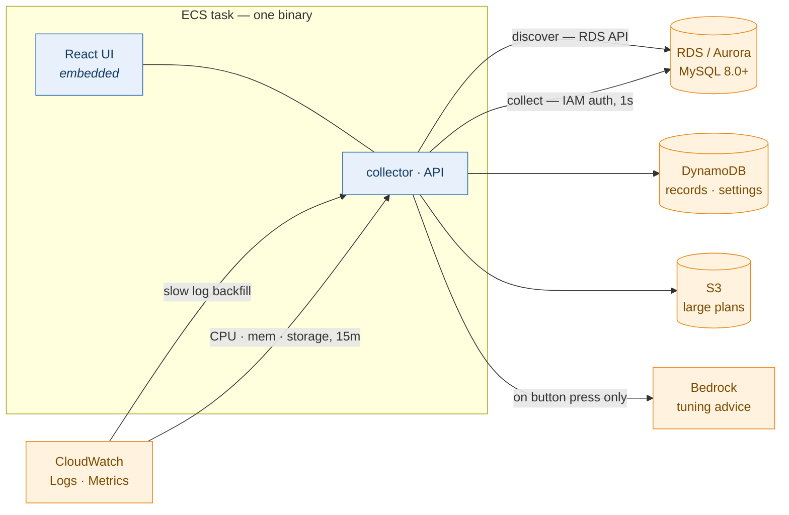

# dbmon — MySQL slow query monitor for AWS RDS / Aurora

Real-time slow query capture, execution plans, CloudWatch metrics, and AI tuning advice for
RDS MySQL and Aurora MySQL — in one Rust binary with an embedded React UI.

> **한국어**: [README.ko.md](README.ko.md) · 설계 문서는 [`docs/`](docs/) (26편, 한국어)



## What it does

| Capability | How |
|---|---|
| **Slow query capture** | 1-second `performance_schema` polling for in-flight queries + CloudWatch Logs slow-log backfill for exact metrics. The two are **merged** into one record, so you get "caught it while running" *and* "exact rows examined". |
| **Execution plans** | `EXPLAIN FORMAT=JSON` re-run (works with `SELECT` privileges alone). Literals are masked at collection time. Rendered as a table **and** a graph. |
| **Fleet metrics** | CloudWatch (CPU / memory / storage, 15-min) side by side with self-collected metrics (connections / QPS / threads / locks, 5-sec). Cost-designed: 3 metrics per engine, aligned-window cache. |
| **AI tuning advice** | One button on a plan → reads table specs + index cardinality from the target DB → Amazon Bedrock → index and rewrite proposals with evidence, appended to the Markdown export. |
| **Discovery** | Tag-based env classification (`dev`/`stg`/`prd`), multi-region, multi-account via `sts:AssumeRole`. Instances register as *stopped*; a human presses **Start**. |
| **Alert channel config** | Slack webhook / bot settings + message template (delivery engine is not wired yet — see [Status](#status)). |

Design principles that shaped the code, in one line each:

- **Loud failures over silent ones.** A failed CloudWatch read is reported as "couldn't read",
  never as an empty value that looks like "no data".
- **No secrets stored.** IAM database authentication only; channel credentials live in Secrets
  Manager and settings hold the *reference*.
- **Literals never leave.** Query literals are masked before they reach plans, alerts, or Bedrock.
- **Nothing destructive is automated.** No DDL execution, no `ANALYZE TABLE`, no auto-start of
  collection.

## Screens

Captured against real RDS and Aurora instances. The account number in the header is replaced
with zeros; everything else — metric values, plan costs, tuning advice — is what the tool
actually produced. The data is synthetic seed data, not anyone's production traffic.

### RDS — discovery and collection control


Discovery registers instances automatically and leaves them **stopped**. Collection starts only
when a human presses the button, and the pause scope can be the whole fleet, one environment,
or one instance.

### Metrics — two sources on one row


CloudWatch (CPU / freeable memory / storage, 15-minute) sits next to self-collected values
(connections, threads, locks, QPS, slow/s, 5-second). `10 / 90` is current connections over
`max_connections` — a ratio, not a bare number, because 10 connections means nothing on its own.

### Instance — one target in detail


### Slow Query — what was caught


**In progress** rows show elapsed-so-far; **tracking lost** rows show a lower bound, because we
know when it started but not when it ended. Saying "4.0s" for a query that may still be running
would be a lie.

### Plan — the stored execution plan


Plans are masked at collection time, so no literals reach this screen regardless of the literal
policy. The same plan as a graph — the 45-million-row hash join is the whole story of this query:


### AI tuning advice


Generated on button press, from the plan plus table specs and index cardinality read out of the
target database. Every claim cites the plan node or the schema row it came from, DDL is shown but
never executed, and what the model could not know is written down instead of guessed.

### Slow Log — the CloudWatch source


### Statistics — digests over time


### Options — runtime settings


Notifications, discovery scope, login, and the Bedrock model. Saved to DynamoDB and applied
within 30 seconds across every worker.

## Status

| Area | State |
|---|---|
| Discovery, capture, plans, metrics, settings, AI tuning | **Working** (verified against real RDS/Aurora) |
| Cognito login | Settings only — the JWKS verifier is not wired (`COGNITO_READY = false`) |
| Alert delivery | Channel + template are stored; rule evaluation / sending is a later milestone |
| Cold-tier archive (Athena/Iceberg) | Withdrawn — DynamoDB retention is 35 days and Markdown export covers the rest |

This is a personal project developed against a real AWS account. The design docs in `docs/`
are the source of truth and record *why* each decision was made, including the ones that were
reversed.

---

# Deploying on ECS

The full path: **container image → DynamoDB tables → IAM → networking → ECS service →
per-database account → screen settings.**

Everything below assumes `ap-northeast-2` and account `123456789012`; substitute your own.
Terraform for all of it lives in [`infra/layers/`](infra/) — the manual steps are spelled out
so you can audit what the Terraform does.

## 1. Image

`.github/workflows/release.yml` publishes on every push to `main`:

```
ghcr.io/<owner>/<repo>:latest          # multi-arch (arm64 + amd64)
ghcr.io/<owner>/<repo>:sha-<commit>    # immutable — use this in task definitions
```

To mirror into your own ECR (recommended for ECS: same-account pulls, no egress, VPC endpoint
support), set two **repository variables** and the `ecr` job starts running:

| Variable | Example |
|---|---|
| `AWS_ROLE_ARN` | `arn:aws:iam::123456789012:role/github-oidc-ecr-push` |
| `ECR_REPOSITORY` | `dbmon` |
| `AWS_REGION` | `ap-northeast-2` (optional, defaults to this) |

The OIDC role that GitHub assumes:

```json
{
  "Version": "2012-10-17",
  "Statement": [{
    "Effect": "Allow",
    "Principal": { "Federated": "arn:aws:iam::123456789012:oidc-provider/token.actions.githubusercontent.com" },
    "Action": "sts:AssumeRoleWithWebIdentity",
    "Condition": {
      "StringEquals": { "token.actions.githubusercontent.com:aud": "sts.amazonaws.com" },
      "StringLike":   { "token.actions.githubusercontent.com:sub": "repo:<owner>/<repo>:*" }
    }
  }]
}
```

```json
{
  "Version": "2012-10-17",
  "Statement": [
    { "Effect": "Allow", "Action": "ecr:GetAuthorizationToken", "Resource": "*" },
    { "Effect": "Allow",
      "Action": ["ecr:BatchGetImage", "ecr:BatchCheckLayerAvailability", "ecr:CompleteLayerUpload",
                 "ecr:InitiateLayerUpload", "ecr:PutImage", "ecr:UploadLayerPart"],
      "Resource": "arn:aws:ecr:ap-northeast-2:123456789012:repository/dbmon" }
  ]
}
```

The image is **arm64-first** (Graviton: same performance, ~20% cheaper). It runs as UID 10001,
contains no compiler or shell utilities, and ships a `HEALTHCHECK` that calls the binary's own
`healthcheck` subcommand — so no `curl` in the runtime layer.

Build locally:

```bash
docker build -t dbmon:dev .
docker run --rm dbmon:dev --version
```

## 2. Storage (DynamoDB + S3)

Two tables. **They must exist before the task starts** — the app does not create them
(creating tables needs `dynamodb:CreateTable`, and a monitoring task should not hold that).

| Table | Keys | Notes |
|---|---|---|
| `dbmon-data` | PK `S`, SK `S` | Slow queries, digests, rollups, instances, checkpoints, tuning advice. TTL attribute `ttl` (35 days). |
| `dbmon-config` | PK `S`, SK `S` | Settings (`CFG/GLOBAL`), pause scopes, leases. No TTL. |

`dbmon-data` needs two GSIs:

| Index | PK | SK | Used for |
|---|---|---|---|
| `GSI1` | `GSI1PK` | `GSI1SK` | digest → recent samples, and the sparse in-flight sweep |
| `GSI2` | `GSI2PK` | `GSI2SK` | duration-bucket queries |

Point-in-time recovery on both is advised. `terraform -chdir=infra/layers/10-storage apply`
creates them with the right key schema (provider 6.x renamed `hash_key` inside GSIs — that is
why the lock file is committed).

Large plans (>300 KB) are offloaded to S3. The bucket is optional; without it those plans are
dropped with a logged reason.

## 3. IAM — task role

The task role is the only identity the app uses. Nine statements, each narrowed on purpose;
`infra/layers/40-compute/iam.tf` is the authoritative version.

### 3.1 Storage

```json
{ "Sid": "DynamoDbData", "Effect": "Allow",
  "Action": ["dynamodb:GetItem","dynamodb:PutItem","dynamodb:UpdateItem","dynamodb:DeleteItem",
             "dynamodb:Query","dynamodb:BatchWriteItem","dynamodb:BatchGetItem"],
  "Resource": ["arn:aws:dynamodb:ap-northeast-2:123456789012:table/dbmon-data",
               "arn:aws:dynamodb:ap-northeast-2:123456789012:table/dbmon-data/index/*",
               "arn:aws:dynamodb:ap-northeast-2:123456789012:table/dbmon-config"] }
```

```json
{ "Sid": "DenyScan", "Effect": "Deny", "Action": ["dynamodb:Scan"], "Resource": "*" }
```

The explicit `Deny` on `Scan` is deliberate: a single accidental scan over a 500-instance table
is both a cost event and a latency event. The code never scans; this makes that structural.

### 3.2 Discovery (RDS)

```json
{ "Sid": "DiscoveryReadOnly", "Effect": "Allow",
  "Action": ["rds:DescribeDBInstances","rds:DescribeDBClusters","rds:DescribeDBEngineVersions",
             "rds:DescribeDBParameters","rds:DescribeDBParameterGroups",
             "rds:DescribePendingMaintenanceActions","rds:ListTagsForResource"],
  "Resource": "*" }
```

`Resource: "*"` is required — `rds:Describe*` does not support resource-level permissions.
Scope is enforced in configuration instead (`discovery.allowed_vpc_ids`,
`denied_name_substrings`, `reject_production_tags`).

### 3.3 Database connection (IAM auth — no passwords)

```json
{ "Effect": "Allow", "Action": ["rds-db:connect"],
  "Resource": "arn:aws:rds-db:ap-northeast-2:123456789012:dbuser:*/dbmon" }
```

`dbuser:*/dbmon` means "the `dbmon` account on any instance". In non-production accounts,
enumerate `db-XXXX` resource IDs instead (`var.db_auth_resource_ids`) so a dev deployment
cannot reach production instances.

> The resource ID is the **`DbiResourceId`** (`db-ABC123…`), not the instance name.
> `aws rds describe-db-instances --query 'DBInstances[].[DBInstanceIdentifier,DbiResourceId]'`

### 3.4 Metrics and slow logs

```json
{ "Sid": "Metrics", "Effect": "Allow",
  "Action": ["cloudwatch:GetMetricData","cloudwatch:ListMetrics"], "Resource": "*",
  "Condition": { "StringEquals": { "cloudwatch:namespace": "AWS/RDS" } } }
```

```json
{ "Sid": "SlowLogRead", "Effect": "Allow", "Action": ["logs:FilterLogEvents"],
  "Resource": ["arn:aws:logs:ap-northeast-2:123456789012:log-group:/aws/rds/instance/*/slowquery:*",
               "arn:aws:logs:ap-northeast-2:123456789012:log-group:/aws/rds/instance/*/slowquery"] }
```

Slow logs contain **query literals**. `/aws/rds/instance/*/slowquery` is far narrower than
`/aws/rds/*`, which would include the audit log — that logs every statement.

If a group does not exist yet (slow log never written, or log export disabled) the app reports
`슬로우로그 원천이 없다 … (장애가 아니다)` once per round at info level and keeps going — a
missing group is an environment fact, not an outage.

### 3.5 Multi-region

No extra IAM. The same task role works in every region; the app creates a client per region.
Set the regions in **Settings → Discovery scope** (or `aws.target_regions` in the file config).
There is no "all regions" option on purpose: each region costs a `DescribeDBInstances` call per
discovery round, and most accounts have RDS in one or two.

Everything the app reads per region needs to exist there: slow-log groups are regional, and
CloudWatch metrics live in the instance's region (the app keys its CloudWatch clients by
`(account, region)` for exactly this reason).

### 3.6 Multi-account

Management account task role:

```json
{ "Sid": "AssumeDiscoveryRole", "Effect": "Allow", "Action": ["sts:AssumeRole"],
  "Resource": ["arn:aws:iam::111122223333:role/dbmon-discovery"] }
```

Target account role `dbmon-discovery` — trust policy:

```json
{ "Version": "2012-10-17",
  "Statement": [{ "Effect": "Allow",
    "Principal": { "AWS": "arn:aws:iam::123456789012:role/dbmon-task" },
    "Action": "sts:AssumeRole",
    "Condition": { "StringEquals": { "sts:ExternalId": "dbmon" } } }] }
```

Permissions:

```json
{ "Version": "2012-10-17",
  "Statement": [{ "Effect": "Allow",
    "Action": ["rds:DescribeDBInstances","rds:DescribeDBClusters","rds:ListTagsForResource",
               "cloudwatch:GetMetricData"],
    "Resource": "*" }] }
```

**Listing is an API call — it needs no network path.** VPC peering or Transit Gateway is only
required for the *next* step, connecting to the database. So "appears in the list but
`unreachable`" is a normal state, and the UI distinguishes it.

For cross-account *collection* you also need `rds-db:connect` in the target account (attach it
to the same `dbmon-discovery` role) and a network path plus security-group rule.

Enter the account list in **Settings → Discovery scope**; it must match
`var.discovery_account_ids`, otherwise discovery fails with `AccessDenied` and those instances
never appear.

### 3.7 Bedrock (AI tuning)

```json
{ "Sid": "InvokeTuningModel", "Effect": "Allow", "Action": ["bedrock:InvokeModel"],
  "Resource": [
    "arn:aws:bedrock:ap-northeast-2:123456789012:inference-profile/global.anthropic.claude-sonnet-5",
    "arn:aws:bedrock:*::foundation-model/anthropic.claude-sonnet-5"
  ] }
```

Two ARNs are needed for cross-region inference profiles: **the profile and the foundation
model it routes to.** Allowing only the profile fails at call time with `AccessDenied`.

Enumerate models rather than using `*` — an account's model list includes image and video
models whose per-call price is orders of magnitude different.

Check what your account can use:

```bash
aws bedrock list-inference-profiles \
  --query 'inferenceProfileSummaries[?contains(inferenceProfileId,`claude`)].inferenceProfileId'
```

Model must also be enabled in the Bedrock console (model access) for the region.

Measured behaviour worth knowing:

- `temperature` is rejected by Claude 5 models (`ValidationException: temperature is
  deprecated for this model`), so the app sends only `maxTokens`.
- A query containing `SLEEP()` can be blocked by some models (`stop_reason=content_filtered`,
  empty output) because it looks like a time-based SQL injection payload. Opus 5 blocks it;
  Sonnet 5 does not. The UI shows that reason verbatim so you can switch models.
- Opus models are verbose — raise **output token limit** to 8000 if answers get truncated.

### 3.8 Alert channel secret

```json
{ "Sid": "ReadChannelSecret", "Effect": "Allow", "Action": ["secretsmanager:GetSecretValue"],
  "Resource": ["arn:aws:secretsmanager:ap-northeast-2:123456789012:secret:dbmon/channel/*"] }
```

Prefix-scoped, because `*` would let the monitoring task read every secret in the account —
including RDS master passwords.

### 3.9 Execution role (separate from the task role)

The ECS **execution** role pulls the image and writes container logs:
`AmazonECSTaskExecutionRolePolicy`, plus `kms:Decrypt` if your ECR or log group uses a CMK.
Keep it separate from the task role — the app must never be able to pull or push images.

## 4. Networking

| Direction | Rule |
|---|---|
| Task → RDS | DB security group: allow **TCP 3306 from the task security group** (not a CIDR). Security-group references survive IP changes. |
| Task → AWS APIs | NAT gateway, or interface VPC endpoints for `dynamodb` (gateway), `rds`, `monitoring`, `logs`, `secretsmanager`, `bedrock-runtime`, `sts`, `ecr.api`, `ecr.dkr`, `s3`. Endpoints avoid NAT data charges and keep traffic off the internet. |
| ALB → Task | Target group on 8080, health check path `/healthz`. |
| Task inbound | Only from the ALB security group. Nothing else. |

**ALB idle timeout must be ≥ 300 seconds.** The WebSocket carries live metrics, and the AI
tuning request can run ~30–100 seconds. At the default 60 s the UI reconnects constantly and
the tuning button returns 504 — which says nothing about the cause.

Aurora: the app connects to the **writer** endpoint of each instance it discovers (instance
endpoints, not the cluster endpoint) so `performance_schema` reads are attributed correctly.

## 5. Task definition

```jsonc
{
  "family": "dbmon",
  "cpu": "512", "memory": "1024",
  "requiresCompatibilities": ["FARGATE"],
  "networkMode": "awsvpc",
  "runtimePlatform": { "cpuArchitecture": "ARM64", "operatingSystemFamily": "LINUX" },
  "taskRoleArn": "arn:aws:iam::123456789012:role/dbmon-task",
  "executionRoleArn": "arn:aws:iam::123456789012:role/dbmon-exec",
  "containerDefinitions": [{
    "name": "dbmon",
    "image": "123456789012.dkr.ecr.ap-northeast-2.amazonaws.com/dbmon:sha-<commit>",
    "portMappings": [{ "containerPort": 8080, "protocol": "tcp" }],
    "environment": [
      { "name": "DBMON__DEPLOYMENT_ENV",           "value": "prd" },
      { "name": "DBMON__AWS__REGION",              "value": "ap-northeast-2" },
      { "name": "DBMON__AWS__ACCOUNT_ID",          "value": "123456789012" },
      { "name": "DBMON__STORAGE__DATA_TABLE",      "value": "dbmon-data" },
      { "name": "DBMON__STORAGE__CONFIG_TABLE",    "value": "dbmon-config" },
      { "name": "DBMON__COLLECTOR__MONITOR_DB_USER", "value": "dbmon" },
      { "name": "DBMON__DISCOVERY__ALLOWED_VPC_IDS", "value": "vpc-0123456789abcdef0" }
    ],
    "stopTimeout": 60,
    "logConfiguration": {
      "logDriver": "awslogs",
      "options": { "awslogs-group": "/ecs/dbmon", "awslogs-region": "ap-northeast-2",
                   "awslogs-stream-prefix": "dbmon" }
    }
  }]
}
```

`stopTimeout` must exceed `http.shutdown_grace_secs` (default 45) or SIGKILL arrives first and
in-flight records are lost.

### Configuration reference

Environment variables override the TOML file; `__` separates levels
(`DBMON__COLLECTOR__SLOW_THRESHOLD_SECS`). Startup **fails fast** on invalid config — a
half-working process that collects but cannot store is worse than one that refuses to boot.

**Required**

| Key | Meaning |
|---|---|
| `deployment_env` | `dev` / `stg` / `prd`. In `dev`, discovery filters become mandatory. |
| `aws.region` | Deployment region. |
| `aws.account_id` | Goes into every `instance_id` — **cannot be changed later**. |
| `storage.data_table`, `storage.config_table` | DynamoDB table names. |

**Frequently set**

| Key | Default | Meaning |
|---|---|---|
| `role` | `all` | `all` / `api` / `collector` / `control`. Split when you scale out. |
| `http.bind`, `http.port` | `0.0.0.0`, `8080` | |
| `http.shutdown_grace_secs` | `45` | Must be < ECS `stopTimeout`. |
| `http.deregistration_wait_secs` | `20` | Set `0` without a load balancer. |
| `http.allow_auth_disable` | `false` | Permits the "no authentication" setting. Two opt-ins required. |
| `aws.target_regions` | `[region]` | Fallback when Settings has no region list. |
| `collector.slow_threshold_secs` | `2` | What counts as slow for detection. |
| `collector.monitor_db_user` | `dbmon` | Also the self-exclusion key. |
| `collector.literal_policy` | `masked` | `masked` / `full` / `full_restricted` / `off`. See below. |
| `collector.backfill_secs` | `60` | Slow-log backfill period. |
| `discovery.allowed_vpc_ids` | `[]` | Required in `dev`. |
| `discovery.collect_production_targets` | `false` | Gate for `prd`-tagged instances. |
| `storage.plan_bucket` | none | S3 bucket for plans > 300 KB. |

**Literal policy** decides whether stored SQL keeps its values:

| Value | Stored SQL | Copy-and-run sample? |
|---|---|---|
| `masked` (default) | `WHERE id = ?` | No |
| `full_restricted` | original | Yes, visible to `operator`+ |
| `full` | original | Yes, subject to `can_see_literals` |
| `off` | not stored | No |

Masking is **one-way**: switching to `masked` later does not remove literals already stored,
and switching away does not recover masked ones. It applies to newly stored records only.
Execution-plan JSON is masked regardless of this setting.

## 6. Database account (per instance)

No passwords are stored anywhere. The app authenticates with a 15-minute IAM token, so the
database account must use `AWSAuthenticationPlugin`.

Prerequisites on the instance:

1. **IAM DB authentication enabled** —
   `aws rds modify-db-instance --db-instance-identifier X --enable-iam-database-authentication`
   (Aurora: on the cluster).
2. **Slow query log on, exported to CloudWatch Logs** — parameter group
   `slow_query_log=1`, `long_query_time=1` (or your threshold), `log_output=FILE`, and
   `EnableCloudwatchLogsExports=["slowquery"]`.
3. `performance_schema=1` (default on `db.t3.medium` and larger).

Then, connected as the master user:

```sql
-- The host pattern must match where the task connects FROM.
-- Use the ECS subnet CIDR, not the task IP: tasks get new IPs on every deploy.
CREATE USER IF NOT EXISTS 'dbmon'@'10.1.%'
  IDENTIFIED WITH AWSAuthenticationPlugin AS 'RDS'
  REQUIRE SSL;

-- Detection, replica status, schema listing.
GRANT PROCESS, REPLICATION CLIENT, SHOW DATABASES, SHOW VIEW ON *.* TO 'dbmon'@'10.1.%';

-- Metrics and digests.
GRANT SELECT ON `performance_schema`.* TO 'dbmon'@'10.1.%';
GRANT SELECT ON `sys`.*                TO 'dbmon'@'10.1.%';

-- Plans and tuning context need SELECT on the monitored schemas.
-- Least privilege: enumerate them. Broad: GRANT SELECT ON *.* (gives cardinality for every table).
GRANT SELECT ON `shop`.* TO 'dbmon'@'10.1.%';

SHOW GRANTS FOR 'dbmon'@'10.1.%';
```

Notes that cost time if you miss them:

- **Read replicas (`-ro`)**: create the user on the **source**. A replica is read-only, so
  `CREATE USER` fails there; the account arrives by replication.
- **Aurora**: create on the writer; it propagates to readers.
- **`REQUIRE SSL`** is not optional for IAM auth — the token travels as the password.
- The IAM token is signed for the **real endpoint**. If you tunnel through SSM for local
  development, sign for the endpoint and only redirect the TCP address
  (`collector.target_endpoint_overrides`, dev + loopback only).
- Client VPN performs source NAT: the database sees the *subnet ENI* address, not the VPN
  client CIDR. Grant the subnet pattern (e.g. `10.1.%`), which then covers both ECS tasks and
  your laptop.

`docs/22-onboarding-a-db.md` walks the whole path, including privilege modes and verification.

## 7. Screen settings

After the service is healthy, open the UI and finish in **Options** (gear, top right):

| Section | What to set |
|---|---|
| **Discovery scope** | Regions to scan; accounts (12-digit ID + role *name*, not ARN) when management-account mode is on. |
| **Login** | `token` (shared token) / `cognito` (settings only for now) / `off` (requires `http.allow_auth_disable`). |
| **AI tuning** | Enable, model ID, Bedrock region, output token limit. |
| **Notifications** | Slack mode, channel, Secrets Manager **reference**, message template with preview. |

Settings are stored in DynamoDB (`CFG/GLOBAL`) and applied within 30 seconds across all
workers, with optimistic locking so two administrators cannot silently overwrite each other.
Details and failure semantics: [`docs/23-settings.md`](docs/23-settings.md).

Then go to the **RDS** tab and press **Start collection** on each instance. Registration is
automatic; starting is not — collection begins querying the target database every second, and
that should be a human decision.

## 8. Verify

```bash
# Health
curl -s http://<alb>/healthz && curl -s http://<alb>/readyz

# Discovery found the instances
curl -s http://<alb>/api/instances | jq 'length, .[0].state'

# Fleet metrics (failed_scopes must be empty)
curl -s http://<alb>/api/metrics/fleet | jq '.failed_scopes, (.rows | length)'

# Collector is leading and ticking
curl -s http://<alb>/api/collector/status | jq '{is_leader, collecting, last_tick_ms}'
```

Common first failures:

| Symptom | Cause |
|---|---|
| Instances stay `pending` | Nobody pressed **Start collection** (by design). |
| `unreachable` | Security group, or the `dbmon` account / IAM auth is missing on that instance. |
| Metrics columns all `—` with `failed_scopes` set | CloudWatch permission, or a cross-account role without `cloudwatch:GetMetricData`. |
| Empty slow query list but instances are `collecting` | Slow log not exported to CloudWatch Logs, or `long_query_time` above your traffic. |
| Tuning button says `model_failed` | The reason is printed next to the button — wrong model ID, model not enabled in the region, or a content filter. |

## Local development

No AWS account required for the core loops:

```bash
docker compose up -d          # MySQL 8.0 / 8.4 + DynamoDB Local
just local-init               # create local tables
cargo run -p dbmon -- --config local/dbmon.toml --log-pretty serve
npm --prefix web run dev      # or use the embedded UI at :8080
```

Against real AWS (SSO + VPN, private seed databases):

```bash
aws sso login --profile <profile>
cargo run -p dbmon -- --config local/dbmon-aws.toml --log-pretty serve
```

Tests: `cargo test` (617 unit + integration, MySQL containers for the integration set) and
`npm --prefix web test`. `cargo clippy --all-targets -- -D warnings` is clean and CI enforces it.

## Repository layout

```
crates/core        domain: no AWS, no MySQL, no HTTP. Ports (traits) live here.
crates/normalize   SQL normalization + literal masking + digests
crates/planparse   EXPLAIN JSON → nodes, warnings, literal masking (T-16)
crates/dbmon       adapters (AWS, MySQL, HTTP) + collector loops + binary
web                React 19 + Tailwind 4 UI, embedded into the binary
infra/layers       Terraform: 00-bootstrap → 10-storage → 40-compute → 60-seed
docs               26 design documents (Korean) — requirements, ADRs, data model, security
```

## License

Not yet licensed. Until a `LICENSE` file lands, all rights reserved — usable for reading and
evaluation, not redistribution.
