# dbmon — MySQL slow query monitor for AWS RDS / Aurora

Real-time slow query capture, execution plans, CloudWatch metrics, and AI tuning advice for
RDS MySQL and Aurora MySQL — in one Rust binary with an embedded React UI.

> **한국어**: [README.ko.md](README.ko.md) · 설치: [`docs/install.md`](docs/install.md)

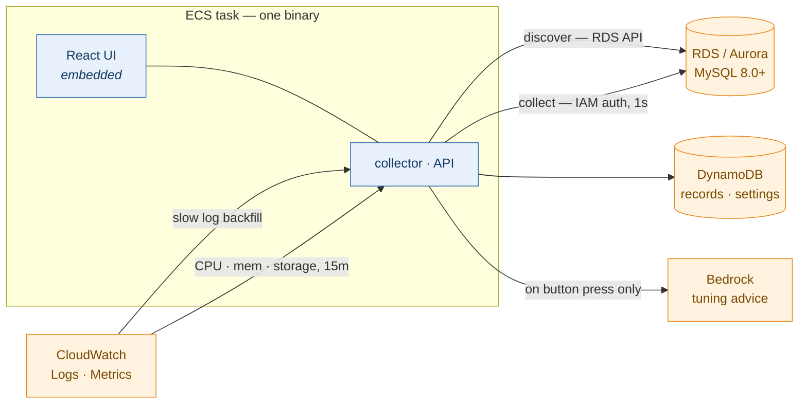

## What it does

| Capability | How |
|---|---|
| **Slow query capture** | 1-second `performance_schema` polling for in-flight queries + CloudWatch Logs slow-log backfill for exact metrics. The two are **merged** into one record, so you get "caught it while running" *and* "exact rows examined". |
| **Execution plans** | `EXPLAIN FORMAT=JSON` re-run (works with `SELECT` privileges alone). Literals are masked at collection time. Rendered as a table **and** a graph. |
| **Fleet metrics** | CloudWatch (CPU / memory / storage, 15-min) side by side with self-collected metrics (connections / QPS / threads / locks, 5-sec). Cost-designed: 3 metrics per engine, aligned-window cache. |
| **AI tuning advice** | One button on a plan → reads table specs + index cardinality from the target DB → Amazon Bedrock → index and rewrite proposals with evidence, appended to the Markdown export. |
| **Discovery** | Tag-based env classification (`dev`/`stg`/`prd`), multi-region, multi-account via `sts:AssumeRole`. Instances register as *stopped*; a human presses **Start**. |
| **Alert channel config** | Slack webhook / bot settings + message template (delivery engine is not wired yet — see [Status](#status)). |

Design principles that shaped the code, in one line each:

- **Loud failures over silent ones.** A failed CloudWatch read is reported as "couldn't read",
  never as an empty value that looks like "no data".
- **No secrets stored.** IAM database authentication only; channel credentials live in Secrets
  Manager and settings hold the *reference*.
- **Literals never leave.** Query literals are masked before they reach plans, alerts, or Bedrock.
- **Nothing destructive is automated.** No DDL execution, no `ANALYZE TABLE`, no auto-start of
  collection.

## Screens

Captured against real RDS and Aurora instances. The account number in the header is replaced
with zeros; everything else — metric values, plan costs, tuning advice — is what the tool
actually produced. The data is synthetic seed data, not anyone's production traffic.

### RDS — discovery and collection control

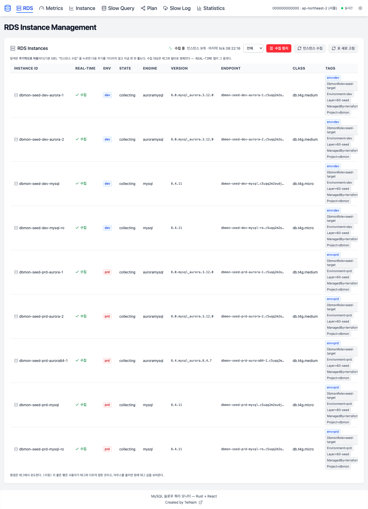

Discovery registers instances automatically and leaves them **stopped**. Collection starts only
when a human presses the button, and the pause scope can be the whole fleet, one environment,
or one instance.

### Metrics — two sources on one row

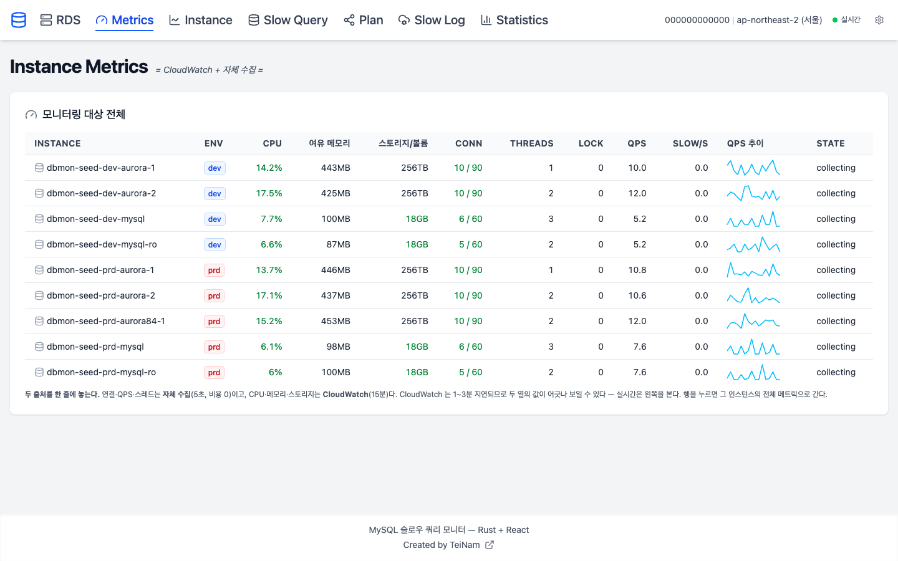

CloudWatch (CPU / freeable memory / storage, 15-minute) sits next to self-collected values
(connections, threads, locks, QPS, slow/s, 5-second). `10 / 90` is current connections over
`max_connections` — a ratio, not a bare number, because 10 connections means nothing on its own.

### Instance — one target in detail

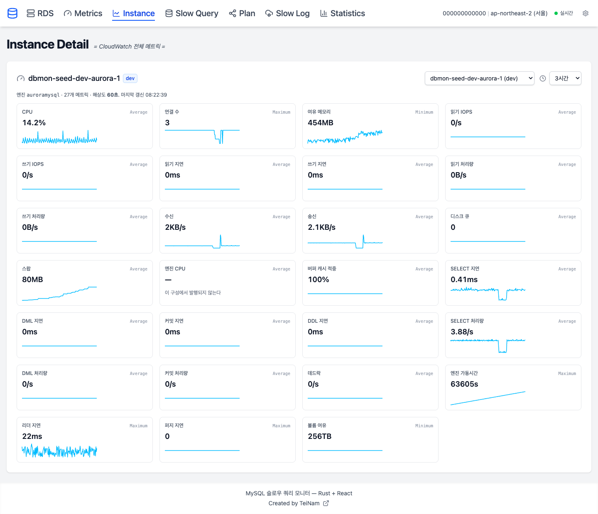

### Slow Query — what was caught

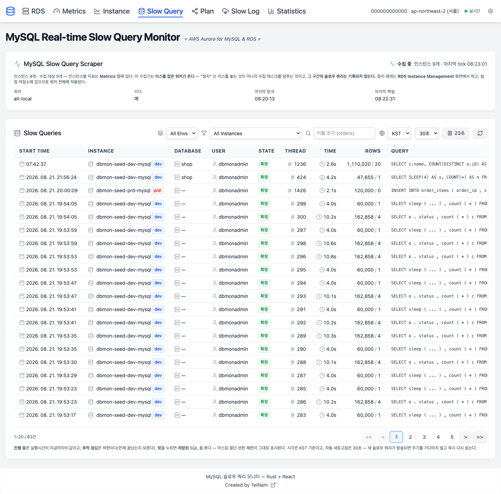

**In progress** rows show elapsed-so-far; **tracking lost** rows show a lower bound, because we
know when it started but not when it ended. Saying "4.0s" for a query that may still be running
would be a lie.

### Plan — the stored execution plan

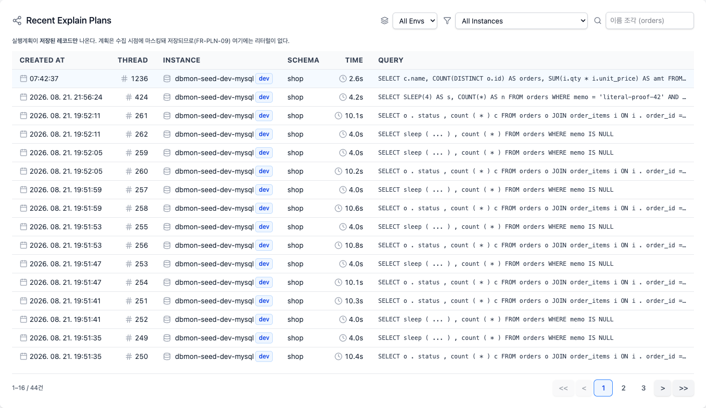

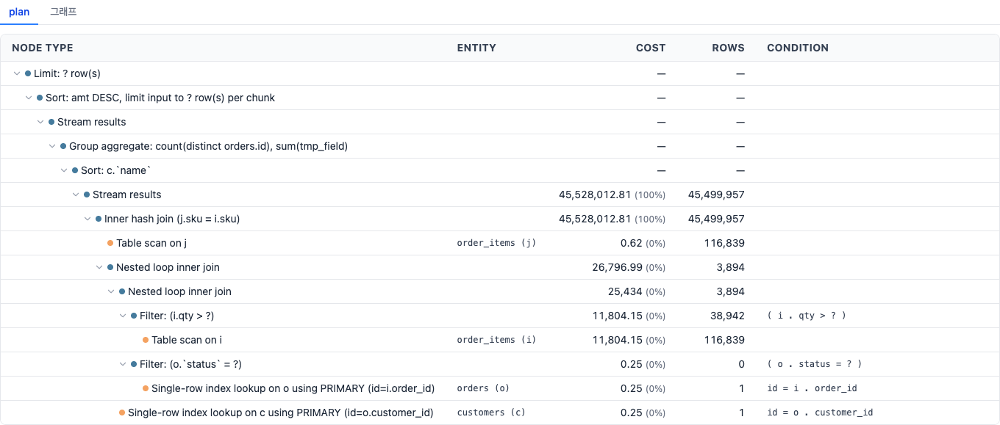

Plans are masked at collection time, so no literals reach this screen regardless of the literal
policy. The same plan as a graph — the 45-million-row hash join is the whole story of this query:

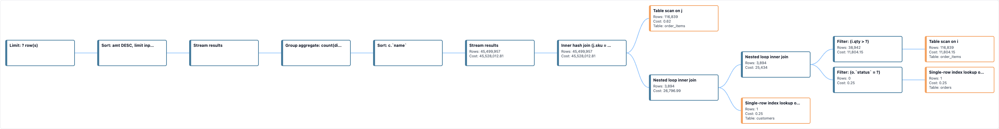

### AI tuning advice

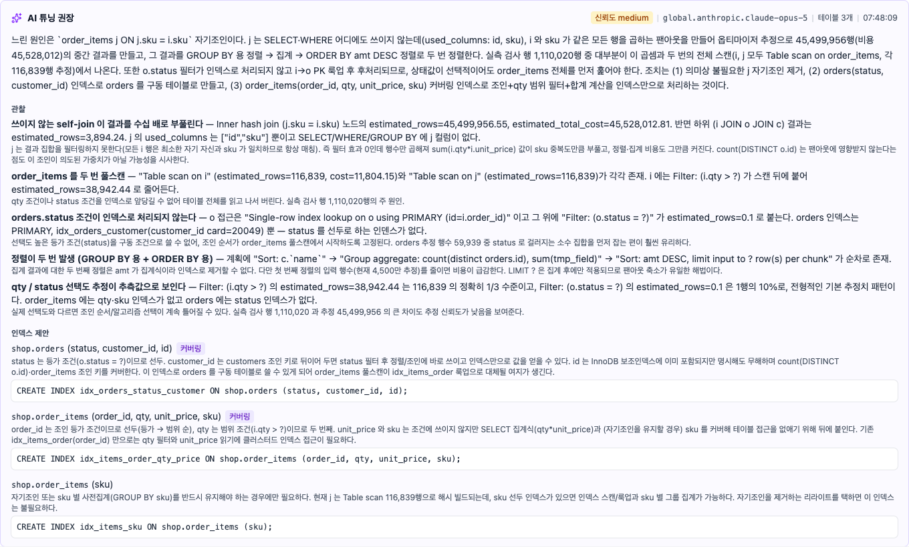

Generated on button press, from the plan plus table specs and index cardinality read out of the
target database. Every claim cites the plan node or the schema row it came from, DDL is shown but
never executed, and what the model could not know is written down instead of guessed.

### Slow Log — the CloudWatch source

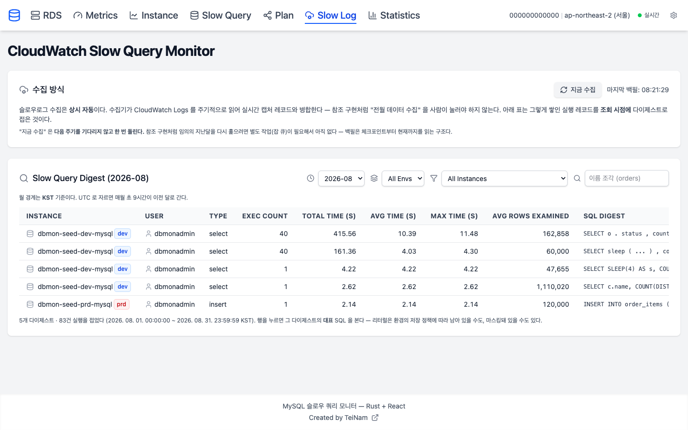

### Statistics — digests over time

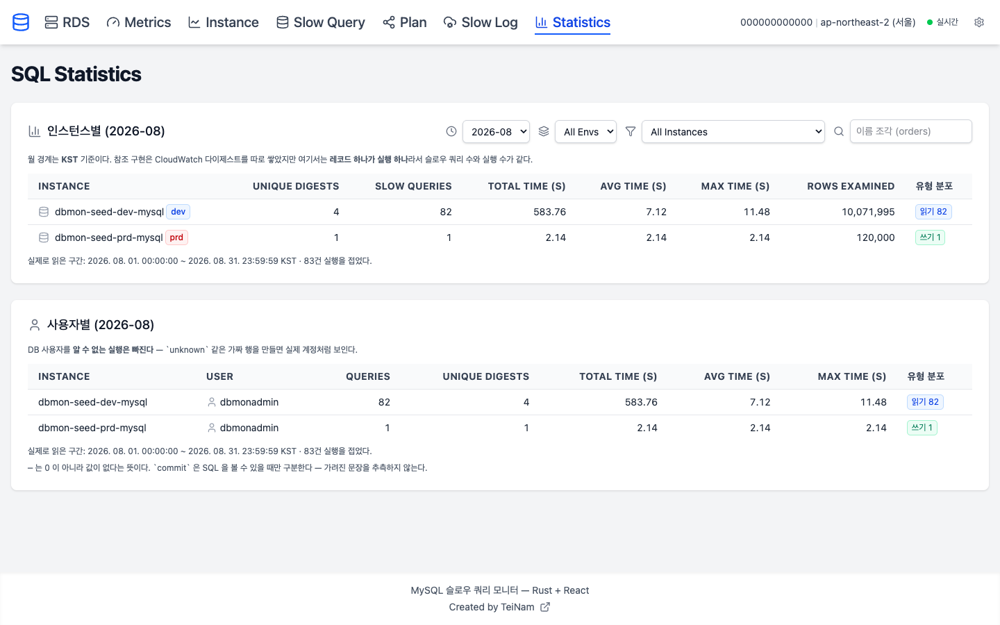

### Options — runtime settings

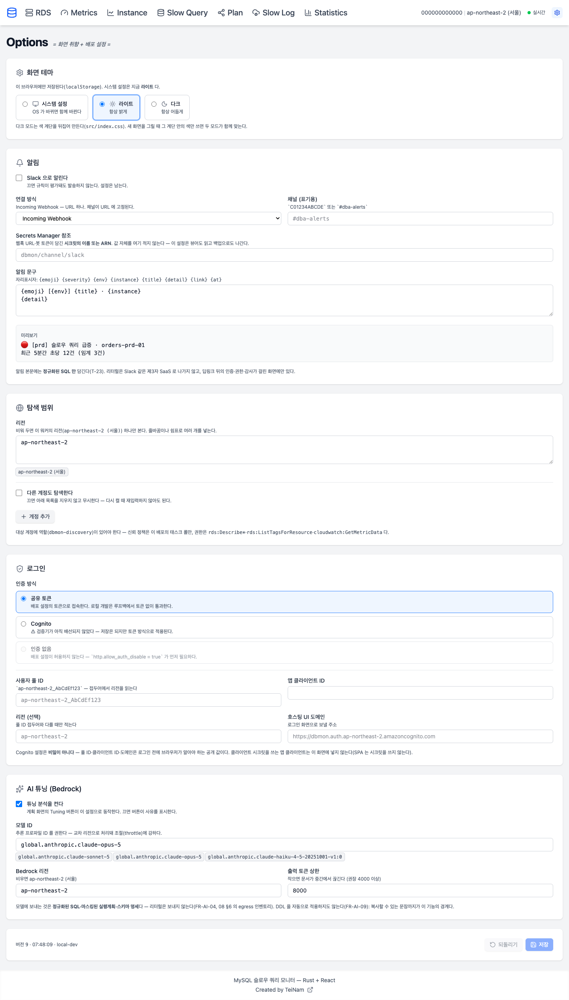

Notifications, discovery scope, login, and the Bedrock model. Saved to DynamoDB and applied
within 30 seconds across every worker.

## Status

| Area | State |
|---|---|
| Discovery, capture, plans, metrics, settings, AI tuning | **Working** (verified against real RDS/Aurora) |
| Cognito login | Settings only — the JWKS verifier is not wired (`COGNITO_READY = false`) |
| Alert delivery | Channel + template are stored; rule evaluation / sending is a later milestone |
| Cold-tier archive (Athena/Iceberg) | Withdrawn — DynamoDB retention is 35 days and Markdown export covers the rest |

This is a personal project developed against a real AWS account. The design docs in `docs/`
are the source of truth and record *why* each decision was made, including the ones that were
reversed.

---

# Deploying on ECS

The full path: **container image → DynamoDB tables → IAM → networking → ECS service →
per-database account → screen settings.**

Everything below assumes `ap-northeast-2` and account `123456789012`; substitute your own.
Terraform for all of it lives in [`infra/layers/`](infra/) — the manual steps are spelled out
so you can audit what the Terraform does.

## Install

The full install guide lives in **[docs/install.md](docs/install.md)** — both paths (by hand and
with Terraform), the IAM policies with the traps called out, security groups, the task definition,
verification, and a table of what breaks and why.

Shortest possible path, for orientation:

```bash
# 1. two DynamoDB tables + a KMS key            → docs/install.md §2
# 2. two IAM roles (task / execution)           → docs/install.md §3
# 3. security groups (app + target DB inbound)  → docs/install.md §4
# 4. push an arm64 image, register the task,
#    create the service                         → docs/install.md §1, §5
curl -s "$URL/readyz" | jq                    # → docs/install.md §8
```

Korean: **[docs/install.ko.md](docs/install.ko.md)**.

## Local development

No AWS account required for the core loops:

```bash
docker compose up -d          # MySQL 8.0 / 8.4 + DynamoDB Local
just local-init               # create local tables
cargo run -p dbmon -- --config local/dbmon.toml --log-pretty serve
npm --prefix web run dev      # or use the embedded UI at :8080
```

Against real AWS (SSO + VPN, private seed databases):

```bash
aws sso login --profile <profile>
cargo run -p dbmon -- --config local/dbmon-aws.toml --log-pretty serve
```

Tests: `cargo test` (617 unit + integration, MySQL containers for the integration set) and
`npm --prefix web test`. `cargo clippy --all-targets -- -D warnings` is clean and CI enforces it.

## Repository layout

```
crates/core        domain: no AWS, no MySQL, no HTTP. Ports (traits) live here.
crates/normalize   SQL normalization + literal masking + digests
crates/planparse   EXPLAIN JSON → nodes, warnings, literal masking (T-16)
crates/dbmon       adapters (AWS, MySQL, HTTP) + collector loops + binary
web                React 19 + Tailwind 4 UI, embedded into the binary
infra/layers       Terraform: 00-bootstrap → 10-storage → 40-compute → 60-seed
docs               install guide (en/ko) + screenshots. Design documents are not published.
```

## License

Not yet licensed. Until a `LICENSE` file lands, all rights reserved — usable for reading and
evaluation, not redistribution.
